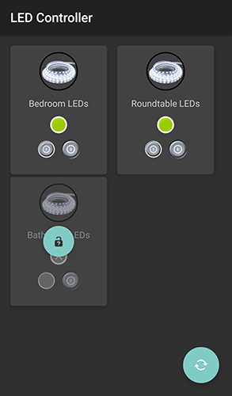
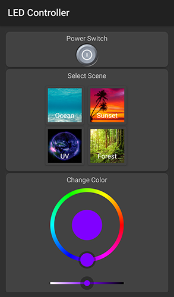
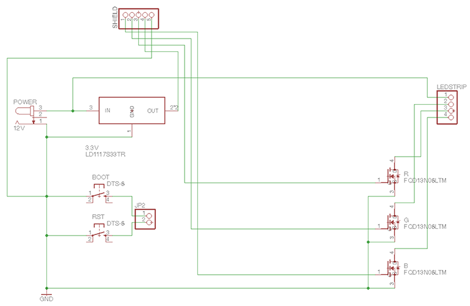
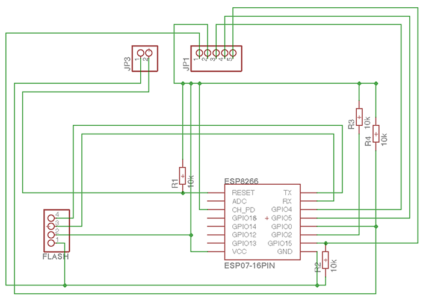
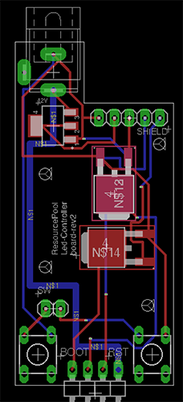
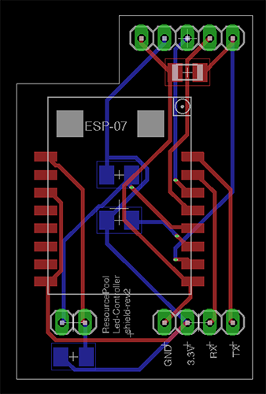

# Led Controller

All-in-one OpenSource & Open Hardware Smartphone-controlled Led Controller for ESP-8266.  

## Requirements

The current version has been rewritten entirely in C/C++ to use along with Arduino IDE.

 * Install Arduino IDE
 * [Install ESP8266 model](https://github.com/esp8266/Arduino)
 * [Install ESP8266 Arduino filesystem uploader plugin](https://github.com/esp8266/arduino-esp8266fs-plugin)
 * Install EAGLE or KiCAD (only if you want to edit the board hardware design)
**NB: You can find a previous version for NodeMCU (in LUA) in previous commits.**

## Schematics
This board is Open-Hardware.  
All parts and schematics are available in the hardware folder.  

## Setup

 * Transfer the content using Arduino onto your ESP-8266.
 * Transfer the files in data/ with the filesystem uploader plugin.

Warning: Your ESP needs to be in bootloader mode!

## Setup Instructions

### 1. First setup
At first power-on, your LEDs will be blinking green. Your device is waiting for you to configure it.

Find the Wifi Access-Point named "Led-SOMETHING", and connect to it from your laptop, your smartphone, or any Wireless device.  
Open your browser and access http://10.0.0.1  

Enter your Wifi credentials, and choose a personal password key for your LED controller. This password will be asked everytime you want to bind your controller to an external control system.

When registered, your LED Controller will restart and blink yellow. Yellow means "I am trying to connect with the credentials you gave me".

If the LED Controller succeeds, the light will turn Blue and stop blinking. That means your LED Controller setup is successful.

Otherwise, after 10 seconds, the LEDs will blink red. This means that your settings did not work correctly.
You can safely reboot (take off the plug, and plug it on again) your LED Controller and start over.

### 2. Updates
Any Wifi network/password change will require the LED Controller to be setup once again. This is a safety measure.

### 3. Android App
When you have installed the APK on your phone, simply launch it and click on "Re-Sync" in the settings tab.
Make sure you are connected on the same wifi network as your LED Controller.

When your Controller is successfully found, a Dialog will pop-up so you can enter your password key.

You're done! The Controller is now successfully paired to your Android App!

** Seeking contributions to improve UX and features of the app.**

### Contributors
All contributions are welcome.
If you want to join the project, please let me know on Twitter [@LoicOrtola](https://twitter.com/loicortola) or start sending PRs ;)
